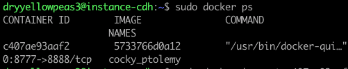
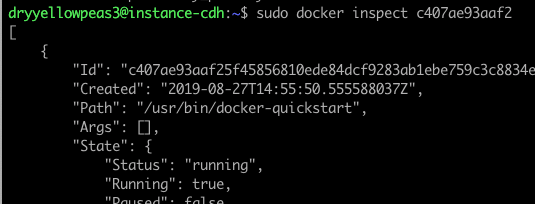
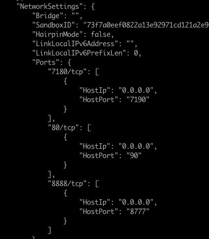

---
---

<link rel="stylesheet" href="styles.css" type="text/css">

## How to check port mapping of a running container on a VM instance on Google Cloud

While leaving the container running in one terminal, open another terminal on your local machine, and connect with the same VM instance via ssh:

    ./bin/gcloud compute --project "my-project-cdh-docker-251102" ssh --zone "us-central1-a" dryyellowpeas3@"instance-cdh" 

Check container's process id:

    sudo docker ps
    

Inspect the container with that id:

    sudo docker inspect <container_id>

Scroll down until "Network settings". These are the mapped ports:

