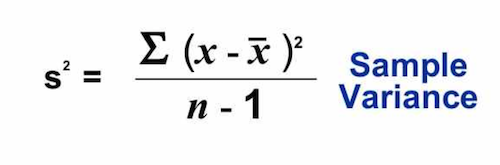

---
---

<link rel="stylesheet" href="styles.css" type="text/css">

```{r setup, include=FALSE}
knitr::opts_chunk$set(echo = TRUE)

library(ggplot2)
library(ggthemes)
library(dplyr)
library(viridis)
library(tidyr)
library(cluster)
library(ggmap)
library(maps)
library(data.table)
```

# Toronto Major Crime Indicators 2014-2018

## 1. Introduction

Toronto Police made publicly available its data on the __["Toronto Police Service Public Safety Data Portal"](https://data.torontopolice.on.ca/search?tags=MCI)__.

We are interested in exploring the __[Major Crime Indicatiors (MCI) for 2014-2018](https://data.torontopolice.on.ca/datasets/mci-2014-to-2018)__.


## 2. Exploratory Data Analysis


Let's load the data:

```{r read csv}
toronto <- fread('./assets/MCI_2014_to_2018.csv')

```

## 3. Data Preparation (Data Munging)

What features are available?

```{r names(toronto)}
names(toronto)
```

The structure of the dataset:
```{r str(toronto)}
str(toronto)
```

Dimensions:

```{r dim(toronto)}
dim(toronto)
```

Are there duplicated event ids?
```{r duplicate ids}
toronto_dupl_ids <- subset(toronto, duplicated(toronto$event_unique_id))
dim(toronto_dupl_ids)

toronto_dupl_rows <- duplicated(toronto)
dim(toronto_dupl_rows)
```

``` {r distinct(select(toront, event_unique_id))}
distinct_ids <- distinct(select(toronto, event_unique_id))
dim(distinct_ids)
```

The dataset has 21708 duplicated event ids, - almost 13%, though no duplicate rows. Some events have the same ids but are split into several offences.

```{r percentage of duplicates}
nrow(toronto_dupl_ids) / nrow(toronto) * 100
```
  
<br>
Let's drop the duplicates:

``` {r drop duplicates}
toronto <- subset(toronto, !duplicated(toronto$event_unique_id))
dim(toronto)
```


In what years did the crimes occur?

```{r unique(toronto$occurrenceyear }
unique(toronto$occurrenceyear) %>% sort()
```

When were the crimes reported?

```{r unique(toronto$reportedyear }
unique(toronto$reportedyear) %>% sort()
```

Let's have a look at how many crimes were reported for each year.

```{r amount of crimes by year }
toronto %>% group_by(occurrenceyear) %>% summarise(n=n())
```
<br>
The amount of crimes reported in the years 2014-2018 is exceeding the prior years by the order of magnitude. Let's work with 2014-2018 crimes only, and remove prior years' data. 

```{r drop prior years }
toronto <- toronto[toronto$occurrenceyear == 2014 | toronto$occurrenceyear == 2015 | toronto$occurrenceyear == 2016 | toronto$occurrenceyear == 2017 | toronto$occurrenceyear == 2018,]
toronto %>% group_by(occurrenceyear) %>% summarise(n=n())
```
``` {r dim(toronto) for 2014-2018}
dim(toronto)
```

Let's keep only the columns that we need.

```{r remove unneeded columns }
keep <- c("event_unique_id", "occurrencedate", "premisetype", "offence", "occurrenceyear", "occurrencemonth", "occurrenceday", "occurrencedayofweek", "occurrencehour", "MCI", "Neighbourhood", "Lat", "Long")
toronto <- subset(toronto, select = keep)
str(toronto)
```

## 4. Data Exploration

### To do: the same as below, but for each of the 5 years: 2014 to 2018

The majority of crimes is "Assault":
``` {r MCI histogram}
# Here, geom_bar(stat="bin") by default, counting cases in each group of MCI
ggplot(toronto, aes(x = MCI)) + 
  geom_bar(width = 0.5) + 
  labs(title = "Major Crime Indicators Toronto 2014-2018", 
       x="Major Crime Indicators", 
       y="Number of Occurences") +
  theme_economist() +
  theme(
    axis.title = element_text(size = 12, face = "bold"),
    axis.title.x = element_text(color="forestgreen", vjust=-0.35),
    axis.title.y = element_text(color="dodgerblue4" , vjust=0.35)
    )
```

### What were the major crimes in Toronto in 2014-2018, overall?

``` {r MCI types}
# To be able to reorder MCI data inside MCI, we need to create a separate n (count) column; 
# "crime" is a (5,2) dataframe with "MCI" and "n" columns.
crime <- toronto %>% group_by(MCI) %>% summarise(n=n())
crime <- crime[order(crime$n, decreasing = TRUE),]
crime
```
``` {r MCI types - plot}
ggplot(data = crime, 
       aes(x = reorder(MCI, n), y = n)) +
  # Here, geom_bar(stat="identity") instructs to represent values of "n"
  geom_bar(stat = 'identity', 
           width = 0.4) +
  geom_text(aes(label = n), 
            hjust = -0.1, 
            size = 3) +
  # to prevent labels to be cut off
  scale_y_continuous(expand = c(.1, .1)) +
  coord_flip() +
  labs(title = "Major Crime Indicators Toronto 2014-2018", 
       x="Major Crime Indicators", 
       y="Number of Occurences") +
  theme_solarized_2() +
  theme(
    plot.title = element_text(size = 16, face = "bold"),
    axis.title = element_text(size = 12, face = "bold"),
    axis.title.x = element_text(vjust=-0.35),
    axis.title.y = element_text(vjust=0.35)
    )
```


### What were the different assault types? Which one is the worst?

``` {r assault types}
# Grouping only those observations that have "Assault" in MCI column
assault_by_offence <- toronto[toronto$MCI == 'Assault', ] %>% group_by(offence) %>% summarise(n=n())
assault_by_offence <- assault_by_offence[order(assault_by_offence$n, decreasing = TRUE), ]
assault_by_offence
```

```{r assault types - plot}
ggplot(data = assault_by_offence, 
       aes(x = reorder(offence, n), y = n)) +
  geom_bar(stat = 'identity', 
           width = 0.6) +
  geom_text(aes(label = n), 
            hjust = -0.1, 
            size = 3) +
  # to prevent labels to be cut off
  scale_y_continuous(expand = c(.1, .1)) +
  coord_flip() +
  labs(x = "Types of Assault",
       y = "Number of Occurrences",
       title = "Assault Types Toronto 2014-2018") +
  theme_economist_white() +
  theme(
    plot.title = element_text(size = 16, face = "bold"),
    axis.title = element_text(size = 12, face = "bold"),
    axis.title.x = element_text(vjust=-0.4),
    axis.title.y = element_text(vjust=0.4)
    )
```


### The top offences

What are other offences, in addition to assault?

``` {r offence types}
crime_by_offence <- toronto %>% group_by(offence) %>%  summarise(n = n())
crime_by_offence <- crime_by_offence[order(crime_by_offence$n, decreasing = TRUE), ]
crime_by_offence
```

```{r offence types - plot}
ggplot(data = crime_by_offence, 
       aes(x = reorder(offence, n), y = n)) +
  geom_bar(stat = 'identity', 
           width = 0.7) +
  geom_text(aes(label = n), 
            hjust = -0.1, 
            size = 2) +
  coord_flip() +
  labs(x = "Types of Offence",
       y = "Number of Occurrences",
       title = "Offence Types Toronto 2014-2018") +
  theme_economist() +
  theme(
    plot.title = element_text(size = 16, face = "bold"),
    axis.title = element_text(size = 12, face = "bold"), 
    axis.text.y = element_text(size = 6),
    axis.title.x = element_text(vjust=-0.4),
    axis.title.y = element_text(vjust=0.4)
    ) 
```

The highest number of offences in toronto in 2014-2018 were:
- assault
- break and entering
- assault with weapon

The second highest number of offences was:
- robbery - mugging
- breaking and entering with intent
- assault wiht bodily harm
- theft over

The third prominent group of offences:
- robbery - other
- robbery with weapon
- assault peace officer


### Total crimes by the hour of the day

``` {r by the hour of the day}
crime_hour <- toronto %>%  group_by(occurrencehour) %>% summarise(n=n())

ggplot(data = crime_hour, aes(x=occurrencehour, y=n)) + 
  geom_bar(stat = 'identity', 
           width = 0.6,
           color = "gray80",
           fill = "gray80") +
  geom_line(size = 1.8, 
            alpha = 0.7, 
            color = "mediumseagreen") +
  geom_point(size = 0.8) +  
  labs( x= 'Hour(24-hour clock)',
        y = 'Number of Occurrences',
        title = 'Total Crimes by Hour of Day in Toronto 2014-2018') +
  theme_bw() +
  theme(plot.title = element_text(size = 16, face = "bold"),
        axis.title = element_text(size = 12))
```

The worst hour is around midnight, another peak time is around noon, followed by around 8pm.


### Crime types by hour of the day

``` {r most frequent crimes by hour}
# grouping by two features
hour.crime <- toronto %>% group_by(occurrencehour, MCI) %>% summarise(n = n())
head(hour.crime)
```

While assaults are the most common crimes throughout the day, they happened more frequently at noon, and then from late afternoons and until after midnight. Break and enter crimes happened more often in the mornings and at around the midnight (when no one was at home or in the office) . Robberies and auto thefts were more likely to happen in the late evenings. All of these patterns make sense.


``` {r MCI by hour of the day, over 5 years}
ggplot(data = hour.crime, 
       aes(x = occurrencehour, 
           y = n, 
           color = MCI)) +
  geom_line(size = 1.5) +
  labs( x= 'Hour (24-hour clock)',
        y = 'Number of Occurrences',
        title = 'Crime Types by Hour of Day in Toronto 2014-2018') +
  theme_bw() +
  theme(plot.title = element_text(size = 16, face = "bold"),
        axis.title = element_text(size = 12))
```

### Crime evolution over 5 years 2014-2018

``` {r MCI evolution 5 years}
year.crime <- toronto %>% group_by(occurrenceyear, MCI) %>% summarise(n = n())

ggplot(data = year.crime, 
       aes(x = occurrenceyear, 
           y = n, 
           color = MCI)) +
  geom_line(size = 1.5) +
  #facet_grid(occurrenceyear ~ .) +
  labs( x= 'Year',
        y = 'Major Crime Indicators',
        title = 'Crime evolution in Toronto over 2014-2018') +
  theme_bw() +
  theme(
    plot.title = element_text(size = 16, face = "bold"),
    axis.title = element_text(size = 12),
    axis.title.x = element_text(vjust=-0.4)
    )
```

### Neighbourhoods with the highest amount of crime

```{r crime by location}
crime_by_location <- toronto %>% group_by(Neighbourhood) %>%  summarise(n=n())
crime_by_location <- crime_by_location[order(crime_by_location$n, decreasing = TRUE), ]
crime_by_location
```

```{r crime by location - plot}
crime_by_location_top20 <- head(crime_by_location, 20)

ggplot(data = crime_by_location_top20,
      aes(x = reorder(Neighbourhood, n), y = n)
      ) +
  geom_bar(stat = 'identity', width = 0.6) +
  geom_text(aes(label = n), hjust = -0.1, size = 3) + 
  scale_y_continuous(expand = c(.1, .1)) +
  coord_flip() +
  labs( x= 'Number of Crime Occurences',
        y = 'Neighbourhoods',
        title = 'Neighbourhoods with Most Crimes - Top 20') +
  theme_bw() +
  theme(plot.title = element_text(size = 16, face = "bold"),
        axis.title = element_text(size = 12))
```


### Safest neighbourhoods

```{r safest neighbourhoods}
tail(crime_by_location, 10)
```


### Top offence types in neighbourhoods

```{r top offence types in which neighbourhoods}
offence_by_location <- toronto %>% group_by(Neighbourhood, offence) %>% summarise(n=n())
offence_by_location <- offence_by_location[order(offence_by_location$n, decreasing = T),]
offence_by_location_top20 <- head(offence_by_location, 20)

ggplot(data = offence_by_location_top20, aes(x = Neighbourhood, y = n, fill = offence)) +
  geom_bar(stat='identity', width = 0.8, position = position_dodge()) +
  labs( x= 'Neighbourhood',
        y = 'Number of Occurrences',
        title = 'Top Offence Type vs. Neighbourhoods') +
  theme_bw() +
  theme(plot.title = element_text(size = 16, face = "bold"),
        axis.title = element_text(size = 12, face = "bold"),
        axis.text.x = element_text(angle = 90, hjust = 1, vjust = .4)
        ) 
```


### MCI by month

```{r major crime indicators by month}
crime_count <- toronto %>% group_by(occurrencemonth, MCI) %>% summarise(Total = n())
crime_count$occurrencemonth <- ordered(crime_count$occurrencemonth, levels = c('January', 'February', 'March', 'April', 'May', 'June', 'July', 'August', 'September', 'October', 'November', 'December'))

ggplot(crime_count, aes(occurrencemonth, MCI, fill = Total)) +
  geom_tile(size = 0.5, color = "white") +
  scale_fill_viridis()  +
  geom_text(aes(label=Total), color = "white") +
  labs( x= 'Month',
        y = 'MCI',
        title = 'Major Crime Indicators by Month Toronto 2014-2018') +
  theme(plot.title = element_text(size = 16), 
        axis.title = element_text(size = 12, face = "bold"),
        axis.text.x = element_text(angle = 50, hjust = .1, vjust = .1),
        axis.title.x = element_text(vjust = -0.1),
        axis.title.y = element_text(vjust = 0.6)
        )
```

### MCI by day of the week

```{r major crime indicators by day of week}
crime_count <- toronto %>% group_by(occurrencedayofweek, MCI) %>% summarise(Total = n())
crime_count$occurrencedayofweek <- ordered(crime_count$occurrencedayofweek, levels = c('Monday', 'Tuesday', 'Wednesday', 'Thursday', 'Friday', 'Saturday', 'Sunday'))

ggplot(crime_count, aes(occurrencedayofweek, MCI, fill = Total)) +
  geom_tile(size = 0.5, color = "white") +
  scale_fill_viridis()  +
  geom_text(aes(label=Total), color = "white") +
  labs( x= 'Day of Week',
        y = 'MCI',
        title = 'Major Crime Indicators by Day of Week Toronto 2014-2018') +
  theme(plot.title = element_text(size = 16), 
        axis.title = element_text(size = 12, face = "bold"),
        axis.text.x = element_text(angle = 50, hjust = 0.1, vjust = .1),
        axis.title.x = element_text(vjust = -0.1),
        axis.title.y = element_text(vjust = 0.1)
        )
```

### To do: Seasonal crime patterns (temperature change, daylight hours, beginning and end school year)


### To do: Homicides


## 5. K-means clustering

The goal is to create clusters of neighbourhoods with similar crime level. 

Let's create a dataframe with neighbourhoods and major crimes, then spread it:

```{r spread neighbourhoods and MCI types}
groups <- toronto %>% group_by(Neighbourhood, MCI) %>% summarise(n=n())
head(groups)
groups_wide <- spread(groups, key = MCI, value = n)
head(groups_wide)
```


### Remove categorical data 

```{r remove categorical data}
z <- groups_wide[, -c(1,1)]
# assure that there is no missing values
z <- z[complete.cases(z),]
```

### Scale data for comparison

```{r scale data}
# find the mean of each feature
m <- apply(z, 2, mean)
# find st.dev. of each feature
s <- apply(z, 2, sd)
z <- scale(z, m, s)
head(z)
```

### Determine the number of clusters (the elbow method)

Within-Cluster Sum of Squares WSS (the sum of the squared deviations from each observation and the cluster centroid).
In other words, it's a sample variance.



WSS as a single value for the whole z dataset (?)

```{r WSS}
wss <- (nrow(z)-1) * sum(apply(z, 2, var)) # the variance is a squared deviation from the mean 
wss
```

WSS as an array of variances for possible values of k, from 2 to 20. 
withinss	= Vector of within-cluster sum of squares, one component per cluster.

```{r wss for k from 2 to 20 }
for (i in 2:20) {
  wss[i] <- sum(kmeans(z, centers=i)$withinss)
}
wss
```

Plotted WSS (type='b' is for both: lines and points.)

```{r WSS plot}
plot(1:20, wss, type='b', xlab='Number of Clusters', ylab='Within groups sum of squares')
```

Based on the plot, we could choose either 5, 8, 9, or 10 clusters (subsequent runs slightly vary the plot, the reason TBD). We'll choose the minumum (5 clusters) and then the maximum 10 clusters.

### Fitting a model, K = 5

```{r kmeans k 5}
kc <- kmeans(z, 5)
kc
```


### Interpretataion

- K-means algorithm gave us 5 clusters with listed amount of neighbourhoods in each. 

- Cluster means: If the ranges of these numbers seem strange, it’s because we standardized the data before performing the cluster analysis. The negative values mean “lower than most” and positive values mean “higher than most”.

- Clustering vector: the first neighbourhood (alphabetically?) belongs to listed cluster number, the second belongs to the next one, and so on.

- A measurements that are more relative would be the withinss and betweenss.
Withinss tells us the sum of the square of the distance from each data point to the cluster center. Lower is better. Betweenss tells us the sum of the squared distance between cluster centers. Ideally we want cluster centers far apart from each other. Higher would be better. 

### Plotting k = 5

```{r clusplot k 5}
z1 <- data.frame(z, kc$cluster)
clusplot(z1, kc$cluster, color=TRUE, shade=F, labels=0, lines=0, main='k-Means Cluster Analysis k=5')
```


### Fitting a model, K = 10

```{r model k 10}
kc <- kmeans(z, 10)
kc
```

### Plotting k = 10

```{r clusplot k 10}
z1 <- data.frame(z, kc$cluster)
clusplot(z1, kc$cluster, color=TRUE, shade=F, labels=0, lines=0, main='k-Means Cluster Analysis k=10')
```


## 6. Hierarchical Clustering

### Dendrogram plot

```{r hcluster}
z2 <- data.frame(z)
distance <- dist(z2)
hc <- hclust(distance)
```


```{r dendrogram plot}
plot(hc, labels = groups_wide$Neighbourhood, main='Cluster Dendrogram', cex=0.65)
```

### Silhouette plot

```{r silhouette k 5}
plot(silhouette(cutree(hc, 5), distance))
```

```{r silhouette k 10}
plot(silhouette(cutree(hc, 10), distance))
```


```{r silhouette k 2}
plot(silhouette(cutree(hc, 2), distance))
```


## Map of Toronto Crimes 2014-2018

```{r major crimes map}
lat <- toronto$Lat
lon <- toronto$Long
crimes <- toronto$MCI
to_map <- data.frame(crimes, lat, lon)
colnames(to_map) <- c('crimes', 'lat', 'lon')

sbbox <- make_bbox(lon = toronto$Long, lat = toronto$Lat, f = 0.01)
my_map <- get_map(location = sbbox, maptype = "roadmap", scale = 2, color="bw", zoom = 10)
ggmap(my_map) +
  geom_point(data=to_map, aes(x = lon, y = lat, color = "#27AE60"), 
             size = 0.5, alpha = 0.03) +
  xlab('Longitude') +
  ylab('Latitude') +
  ggtitle('Location of Major Crime Indicators Toronto 2014-2018') +
  guides(color=FALSE)
```


### Location of major crime indicators

```{r maps one per major crime}
ggmap(my_map) +
  geom_point(data=to_map, aes(x = lon, y = lat, color = "#27AE60"), 
             size = 0.5, alpha = 0.05) +
  xlab('Longitude') +
  ylab('Latitude') +
  ggtitle('Location of Major Crime Indicators Toronto 2014-2018') +
  guides(color=FALSE) +
  facet_wrap(~ crimes, nrow = 2)
```


