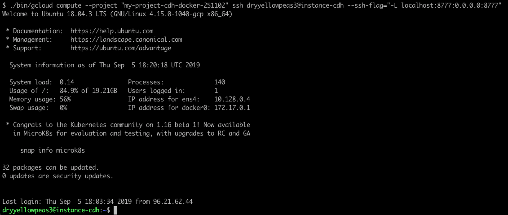
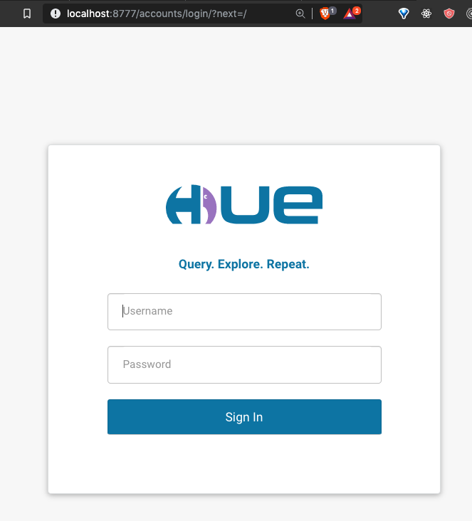
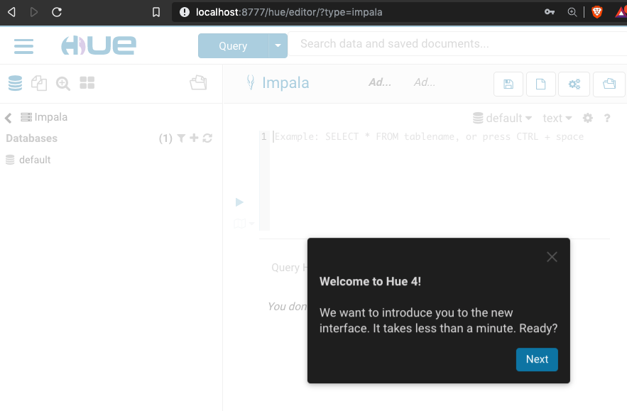

---
---

<link rel="stylesheet" href="styles.css" type="text/css">

## Running Cloudera Quickstart Image on Google Cloud instance - Part 2 : Getting Hue to work

Continued from __[Cloudera Quickstart on Google Cloud Platform - Part 1](2019-09-05-ClouderaOnGCP.html)__

### 1. Create an SSH tunnel

To access your Hue service via browser, you’ll need to forward port 8777 to your local machine using ssh. ssh flags can be passed via gcloud. On your local terminal (in your /google-cloud-sdk directory), type:

    ./bin/gcloud compute --project "my-project-cdh-docker-251102" ssh dryyellowpeas3@instance-cdh --ssh-flag="-L localhost:8777:0.0.0.0:8777"
    

We are using port 8777 because we mapped this port to the normal TCP port 8888 up when we started the container ( step 8 in Part 1).

It is also possible to __[check port mapping on a running container](./Port_Mapping_Container.html)__.

### 2. Open localhost:8777

Username and password: cloudera/cloudera

