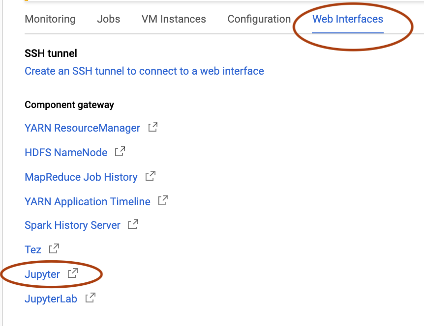
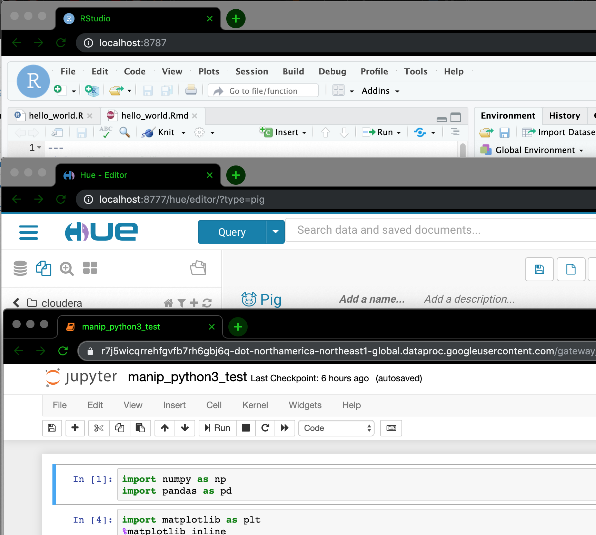

<link rel="stylesheet" href="styles.css" type="text/css">

```{r setup, include=FALSE}
knitr::opts_chunk$set(echo = TRUE)
```


Clusters are usually used for compute-intensive deep learning algorithms and Big Data crunching. When creating a cluster, CGP automatically installs Hadoop, Spark, Hive, and Pig (their version updates TBD). 

However, the same cluster (since it is a virtual machine) can run other applications, like Jupyter Notebook, RStudio, and Docker images. It is economical (proof). In fact, GCP itself has instructions for installing Jupyter Notebook and RStudio on a cluster: (links here)


### Part 1. Create a cluster and run Jupyter Notebook. 

0. Create a bucket (where all your Jupyter Notebook and RStudio files will be saved). Buckets will exist as long as you have your GCP account. You can delete VMs and create new ones, pointing them to this bucket.

1. Create a project , then Dataproc -> Create Cluster / changed only zone to northeast-.... and change storage type to SSD

2. **ATTENTION: Choose a correct cluster version:** only  __[Cluster version 1.4](https://cloud.google.com/dataproc/docs/tutorials/python-configuration#image_version_14)__ has Python 3 pre-installed.

3. Choose whether you need Anaconda or Miniconda: 
  (__[a link](http://deeplearning.lipingyang.org/2018/12/23/anaconda-vs-miniconda-vs-virtualenv/)__ to help decide if you need Anaconda or Miniconda) 

4. Designate the bucket. 

The Jupyter notebooks will be saved in /bucket_name/notebooks/jupyter/

5. Create. 

6. Click on your cluster, then "Web Interfaces", then on Jupyter. The Jupyter Notebook will open in your local web browser.



### Look around at what is already pre-installed on this cluster

You can access your cluster (which is VM) with SSH and look around what is installed.

Check hadoop version
(images here)
spark-shell (image) (-> scala)
hive 
no hbase (!)
pig version 0.17.0


### Part 2. Install RStudio server

Follow GCP instrustions: __[Running RStudio® Server on a Cloud Dataproc Cluster](https://cloud.google.com/solutions/running-rstudio-server-on-a-cloud-dataproc-cluster?authuser=1)__

Here is a recap:

image of Debian 9 commands
```
$ sudo apt-get install gdebi-core
$ wget https://download2.rstudio.org/server/debian9/x86_64/rstudio-server-1.2.1335-amd64.deb
$ sudo gdebi rstudio-server-1.2.1335-amd64.deb
```

Add user abby/abby123  (for RStudio)

issue a gcloud command from your local computer 

```
gcloud compute ssh \
    --zone=northamerica-northeast1-c \
    --project="drycluster" \
    "cluster-7676-m" -- \
    -L 8787:localhost:8787
```

to view all these project values, GCP provides hints, just in different places :)


The R files are saved in RStudio user (that we created) home directory: /home/abby/

- You can install packages in RStudio the usual way
For example, knitr: Install -> CRAN packages window appears, start installation.

Copy  RStudio files or folders into the bucket:

```
gsutil cp hello_world.Rmd gs://my_bucket
```
To download your work files onto your local computer, choose Download on the right of this file in the bucket.

To finish with the user "abby", type "exit", the prompt will revert to your usual cluster's username. (The second "exit" command will disconnect SSH).

### Part 3 (optional). Install Cloudera CDH Quickstart 

It is possible to install Cloudera CDH Quickstart docker image just like on any other separate VM instance. Hypothetically, all three (RStudio, Hue, and Jupyter Notebook) could run at the same time.



Follow the same instructions as in

__[Cloudera Quickstart on Google Cloud Platform - Part 1](2019-09-05-ClouderaOnGCP.html)__

__[Cloudera Quickstart on Google Cloud Platform - Part 2: Getting Hue to Work](2019-09-05-ClouderaOnGCP-2.html)__

<br>

## <span style="color:red">REMINDER: STOP YOUR CLUSTER EVERY TIME YOU FINISH WORKING</span>

<br>

### Part 4. To clarify SSH connections

- If you don't specify a username during SSH connection, you will end up with your local machine's username:

```
gcloud compute ssh \
    --zone=northamerica-northeast1-c \
    --project="beautiful-cluster" \
    "my-cluster-m"
```
Resulting prompt:

**`my_own_username_on_my_Mac@my-cluster-m:~$`**


- You can specify your main CGP account name as username:

```
./bin/gcloud compute ssh <my_CGP_account_name>@"my-cluster-m" \
    --zone=northamerica-northeast1-c \
    --project="beautiful-cluster"
```
Resulting prompt:

**`my_CGP_account_name@my-cluster-m:~$`**


- You can specify any other username that you have already created (for example, for RStudio):

```
./bin/gcloud compute ssh <my_RStudio_username>@"my-cluster-m" \
    --zone=northamerica-northeast1-c \
    --project="beautiful-cluster"
```
Resulting prompt:

**`my_RStudio_username@my-cluster-m:~$`**

- You could save time and create an SSH tunnel at the same time as you are SSH-connecting with your cluster, by adding an SSH flag at the end:
  - for Hue:
      `--ssh-flag="-L localhost:8777:0.0.0.0:8777"`
      
  - for RStudio:
      `--ssh-flag="-L localhost:8787:0.0.0.0:8787"`
  
Example:

```
./bin/gcloud compute ssh <my_RStudio_username>@"my-cluster-m" \
    --zone=northamerica-northeast1-c \
    --project="beautiful-cluster" \
    --ssh-flag="-L localhost:8777:0.0.0.0:8777"
```

After this one command you can open local web browser with `localhost:8777` or `localhost:8787` .


(A hint for these values: GCP provides these hints in a "view gcloud command" sentence, it just takes a bit of time to figure where it is). In case of Dataproc Cluster, the hints are in Cluster details -> VM instances -> SSH -> "view gcloud command"

image here


Similar posts:
__[Starting to develop in Spark with Jupyter installed in a Big Data cluster](https://towardsdatascience.com/starting-to-develop-in-pyspark-with-jupyter-installed-in-a-big-data-cluster-8a84e4db27e4)__