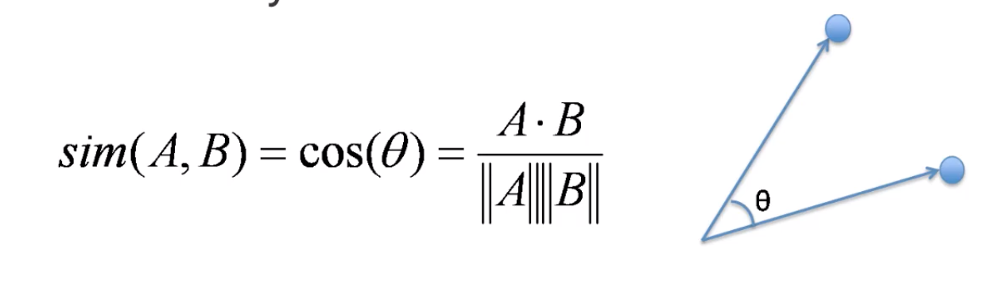

```{r setup, include=FALSE}
knitr::opts_chunk$set(echo = TRUE)
```

Simple Example:

- You have two documents:
  - "Blue House"
  - "Red House"
  
- Featurize based on word count:
  - "Blue House" -> (red,blue,house) -> (0,1,1)
  - "Red House" -> (red,blue,house) -> (1,0,1)

We've turned the words into vectors, or "bags of words". We can use cosine similarity on the vectors to determine similarity of the documents themselves:



If we are treating documents as vectors of features, then we can perform mathematical operations on them, like cosine similarity, or other similarity metrics.

For example, we can improve on Bags of Words by adjusting word counts based on their frequency in the corpus
  