<link rel="stylesheet" href="styles.css" type="text/css">


```{r setup, include=FALSE}
knitr::opts_chunk$set(echo = TRUE)
```

### How to share clipboard info between host and VM

- Settings -> General -> Advanced -> change both "Shared Clipboard" and "Drag'n'Drop" to "Bidirectional", click OK :

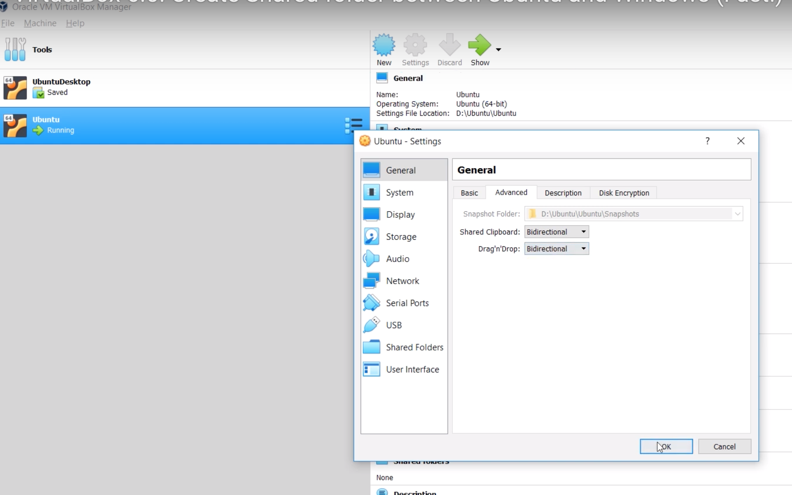

- Clipboard copy-paste should work: copy a line from the host onto clipboard and paste into VM.

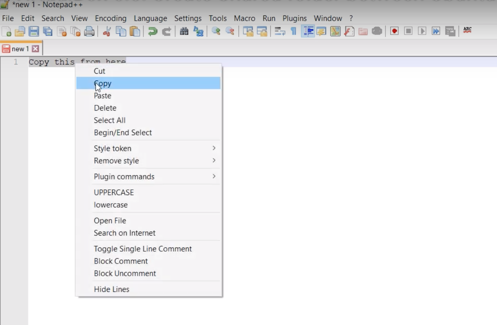
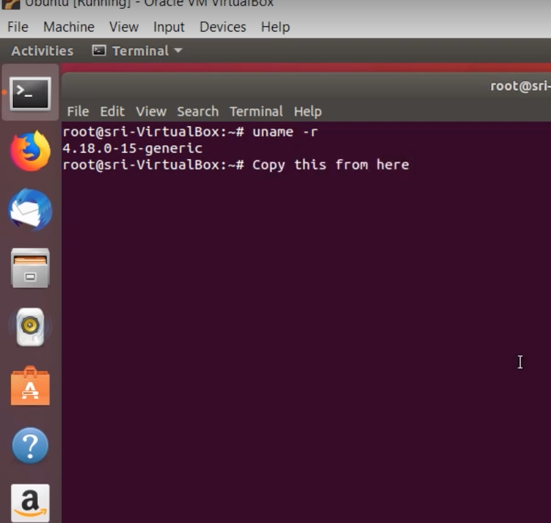

### How to create a shared folder

- On VM: Settings -> General -> Shared Folders -> plus sign:

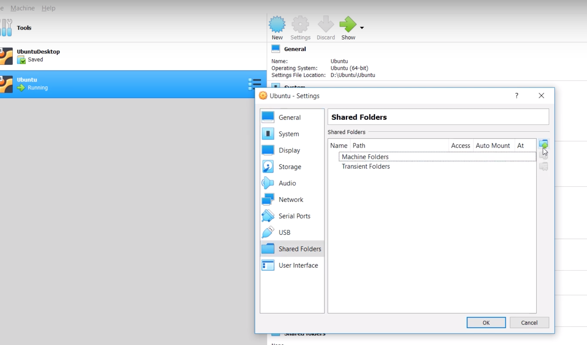

- Click on Folder Path:

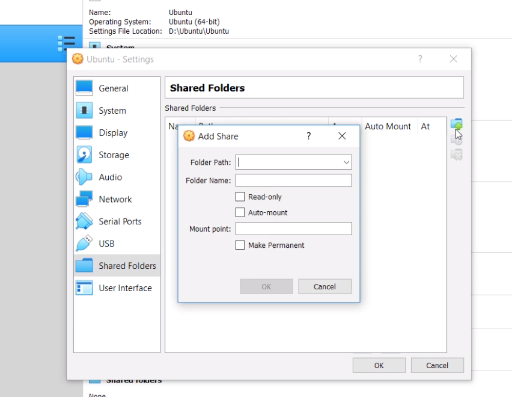

- Create a new folder (or choose existing one):

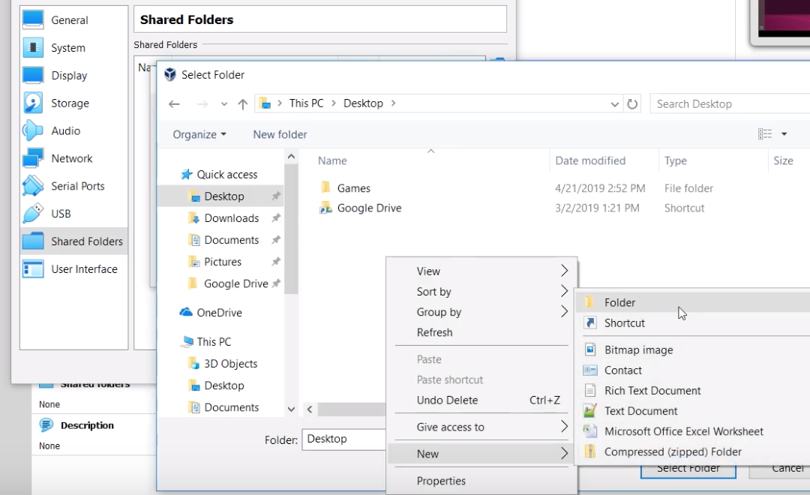

- Name it "SharedDrive":

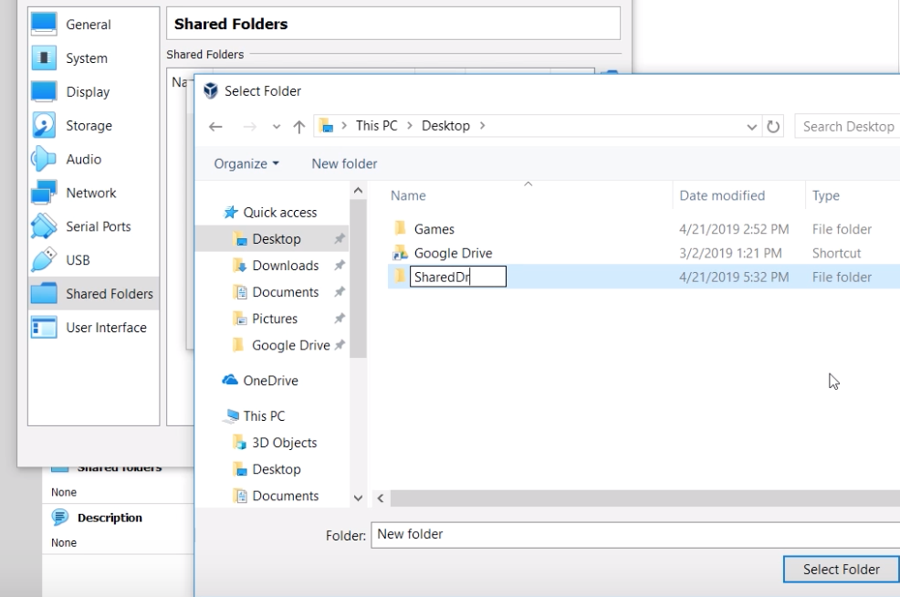

- Click "Select Folder"

- Click "Auto-mount" and "Make Permanent":

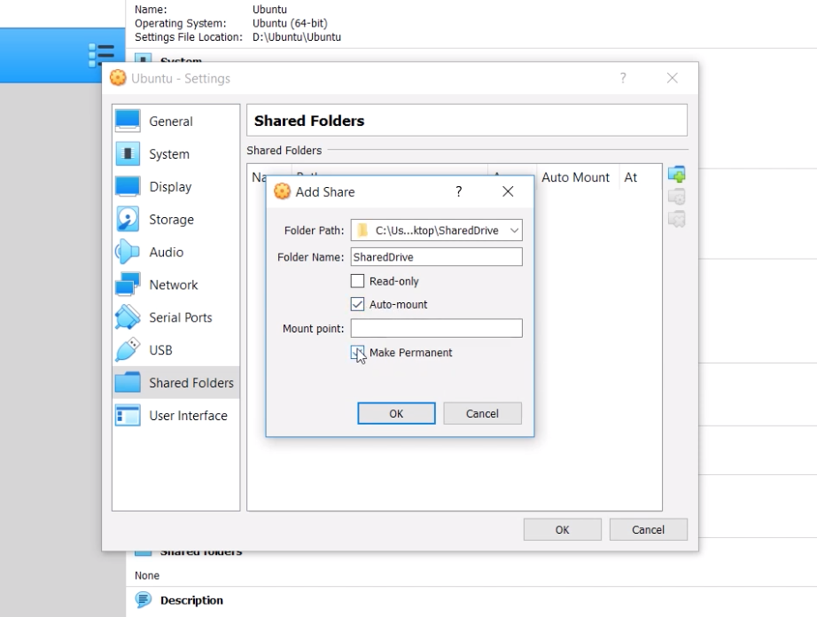

- Click OK.

- Now you have a line under "Machine Folders" on VM:

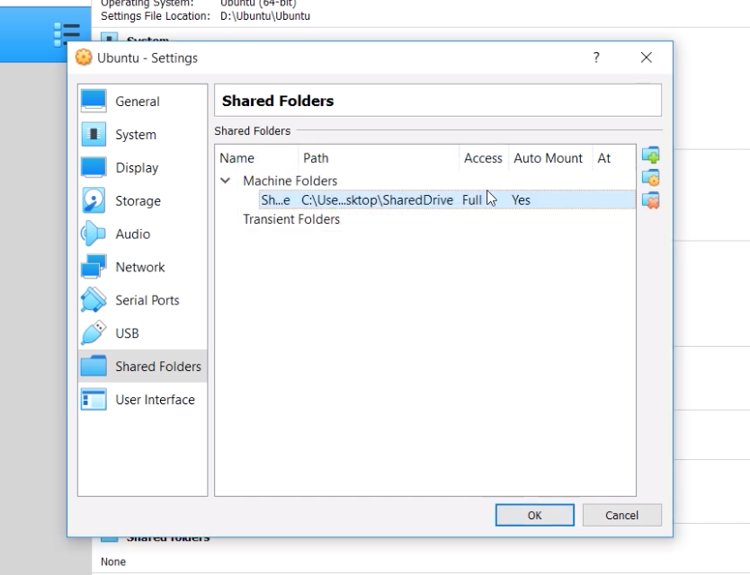

- Click OK.

- On the host system, create a file "File1" in the SharedDrive folder:

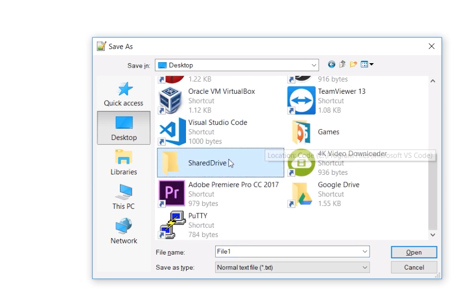

- On VM, create a directory on desktop and mount SharedDrive on it:

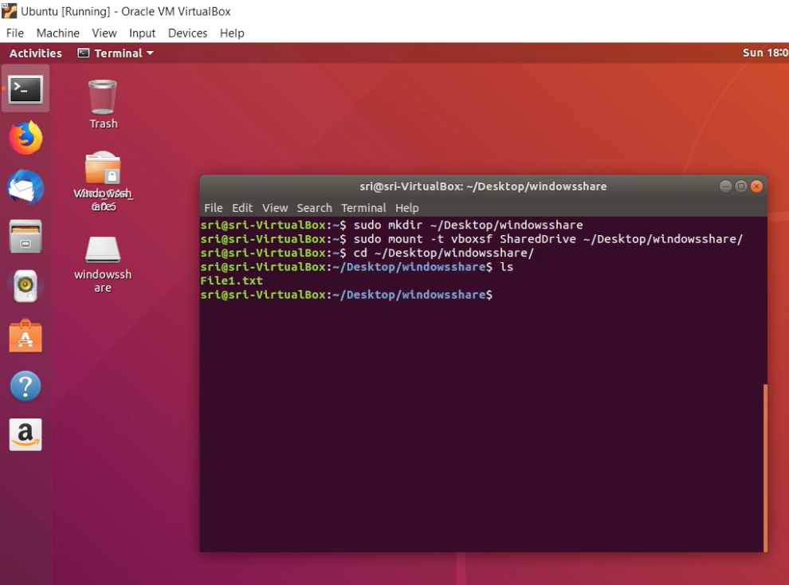


