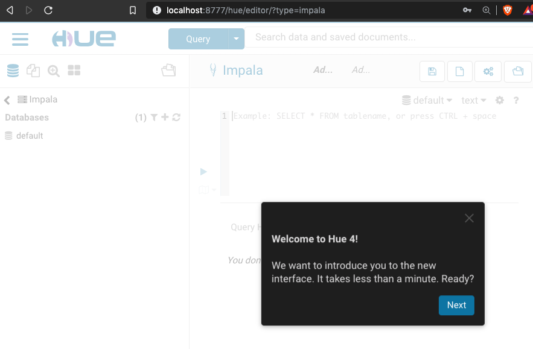
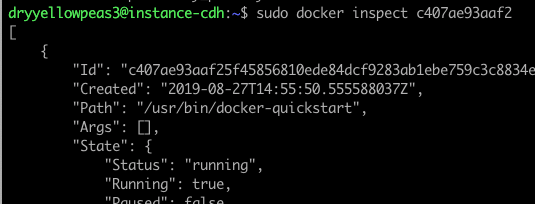
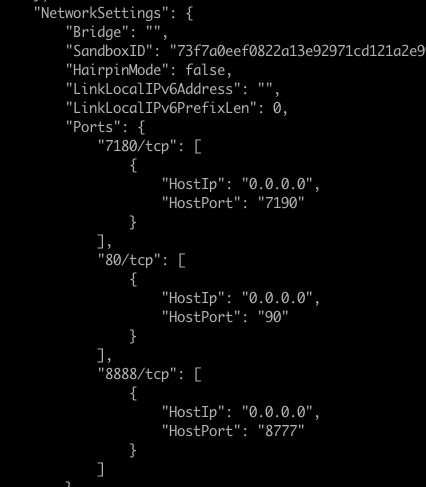

---
---

<link rel="stylesheet" href="styles.css" type="text/css">

## Running Cloudera Quickstart Image v5.13 on Google Cloud instance - Part 2 : Getting Hue to Work

Continued from __[Cloudera Quickstart on Google Cloud Platform - Part 1](ClouderaOnGCP.html)__

### 1. Create an SSH Tunnel

To access your Hue service via browser, you’ll need to forward port 8777 to your local machine using ssh. ssh flags can be passed via gcloud:

    /bin/gcloud compute --project "my-project-cdh-docker-251102" ssh dryyellowpeas3@instance-cdh --ssh-flag="-L localhost:8777:0.0.0.0:8777"
    
We are using port 8777 because we mapped this port to the normal TCP port 8888 up when we started the container ( __[step 8](./ClouderaOnGCP.html)__ in Part 1).

It is also possible to check port mapping on running docker container (explained in the Optional section further down.)

### 2. Open localhost:8777

Username and password: cloudera/cloudera

#### (Optional) How to check port mapping on running container

While leaving the container running in one terminal, open another terminal on local machine, and connect with the same VM instance via ssh (command 1 in Part 1).

    ./bin/gcloud compute --project "my-project-cdh-docker-251102" ssh --zone "us-central1-a" dryyellowpeas3@"instance-cdh" 

Check container's process id:

    sudo docker ps
    

Inspect the container with that id:

    sudo docker inspect <container_id>

Scroll down until "Network settings":

