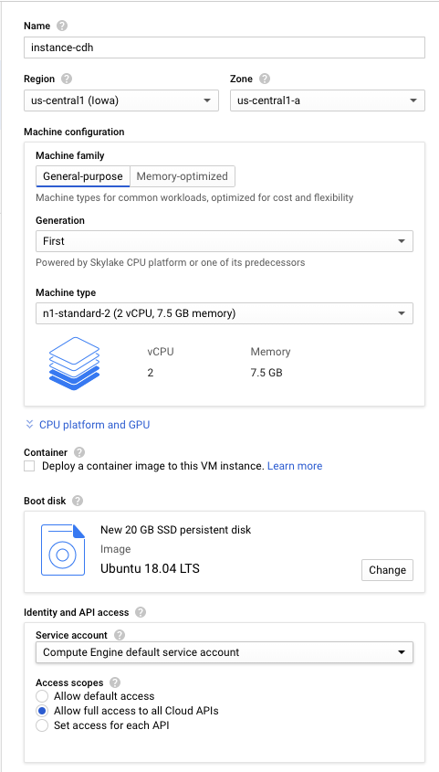
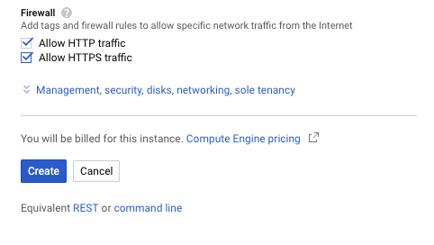
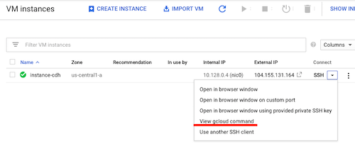
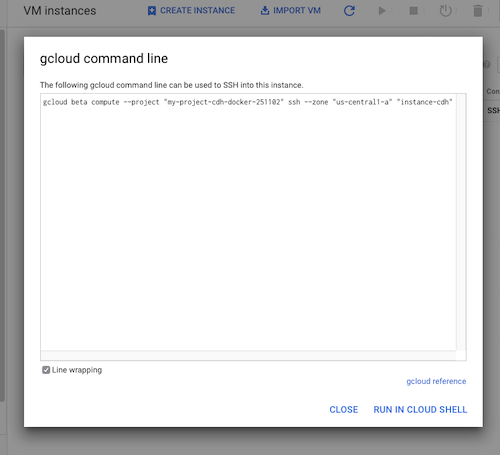
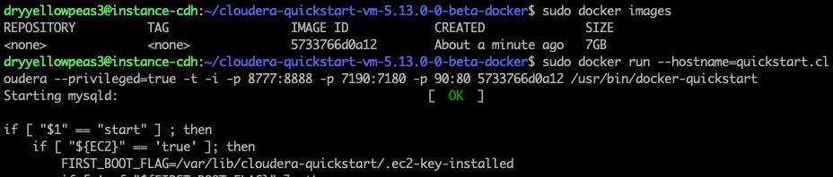
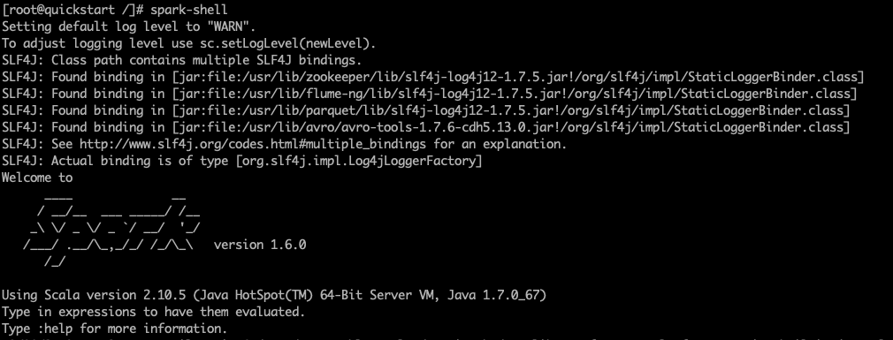
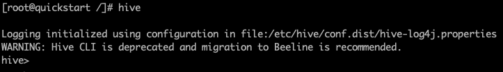
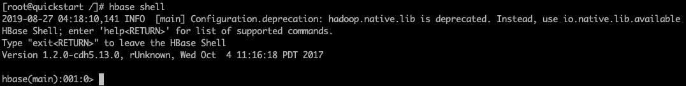

---
---

<link rel="stylesheet" href="styles.css" type="text/css">

## Running Cloudera Quickstart Image on Google Cloud instance

Inspired by these Medium articles:
 
__[Big Data as a Service, get easily running a Cloudera Quickstart Image with Dockers in GCP](https://medium.com/@alipazaga07/big-data-as-a-service-get-easily-running-a-cloudera-quickstart-image-with-dockers-in-gcp-34d28aa7dad7)__

__[How to get up and running with Cloudera’s Quickstart Docker Container](https://medium.com/@SnazzyHam/how-to-get-up-and-running-with-clouderas-quickstart-docker-container-732c04ed0280)__

##### 0. Preliminary Step: Create an Instance on Google Cloud
Create a project and a VM instance on Google Cloud's __[Compute Engine](https://console.cloud.google.com/compute/)__, with 7.5 GB memory and 20 GB disk (this is the absolute minimum!)

##### 1. Connect to VM instance via SSH
From your local machine's terminal, connect to the instance with SSH:

    ./bin/gcloud compute --project "my-project-cdh-docker-251102" ssh --zone "us-central1-a" dryyellowpeas3@"instance-cdh" 
    
To figure what flag values you need to use, click on down-arrow next to "SSH".

Choose "View gcloud command". View or copy your flags' values and paste them into the above command.

If you have more than one Google account, insert also a username before the instance name.
    
##### 2. Install Docker:

    curl -sSL https://get.docker.com/ | sh
    
##### 3. Update:

    sudo apt-get update

##### 4. Get the Cloudera Quickstart Image:

    sudo wget https://downloads.cloudera.com/demo_vm/docker/cloudera-quickstart-vm-5.13.0-0-beta-docker.tar.gz
    
##### 5. Extract .tar file:

    tar xzf cloudera-quickstart-vm-*-docker.tar.gz

##### 6. Import the docker image
Change into `cloudera-quickstart-vm-5.13.0-0-beta-docker` directory and import the docker image.
 
If you run out of space, remove the tar.gz file (in the parent directory), change into `cloudera-quickstart-vm-5.13.0-0-beta-docker` directory and re-run the import:

    sudo docker import cloudera-quickstart-vm-5.13.0–0-beta-docker.tar
    

##### 7. Check container images:

    sudo docker images
    
##### 8. Run container:

    sudo docker run --hostname=quickstart.cloudera --privileged=true -t -i -p 8777:8888 -p 7190:7180 -p 90:80 5733766d0a12 /usr/bin/docker-quickstart
    

### This is the end of one-time setup process

From now on (after restarting your VM instance), 

1) login to your VM with remote ssh:

`./bin/gcloud compute --project "my-project-cdh-docker-251102" ssh --zone "us-central1-a" dryyellowpeas3@"instance-cdh"`
    
2) check for the container id:

`sudo docker images`
    
3) you can check what is running:

`sudo docker ps`
    
4) and start the container:

`sudo docker run --hostname=quickstart.cloudera --privileged=true -t -i -p 8777:8888 -p 7190:7180 -p 90:80 5733766d0a12 /usr/bin/docker-quickstart`

After running the container, we are now inside the container's shell. 

- Test Spark:

- Test Hive:

- Test HBase:

## Connecting to Hue web interface

Discussed in __[Cloudera Quickstart on Google Cloud Platform - Part 2: Getting Hue to Work](ClouderaOnGCP-2.html)__
