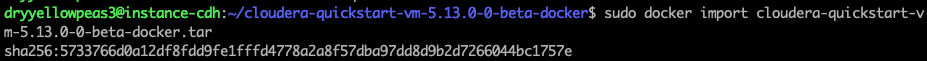

---
---

<link rel="stylesheet" href="styles.css" type="text/css">

## Running Cloudera Quickstart Image v5.13 on Google Cloud instance

Inspired by these Medium articles:
 
__[Big Data as a Service, get easily running a Cloudera Quickstart Image with Dockers in GCP](https://medium.com/@alipazaga07/big-data-as-a-service-get-easily-running-a-cloudera-quickstart-image-with-dockers-in-gcp-34d28aa7dad7)__

__[How to get up and running with Cloudera’s Quickstart Docker Container](https://medium.com/@SnazzyHam/how-to-get-up-and-running-with-clouderas-quickstart-docker-container-732c04ed0280)__

Create a project and a VM instance on GCP, with 7.5 GB memory and 20 GB disk (this is the absolute minimum!)

##### 1. Connect with SSH
From your local machine's terminal, connect to the instance with SSH. To see what flag values you need to use, use this trick: on the instances list screen, click on down-arrow next to "SSH".

Choose "View gcloud command".

If you have more than one Google account, insert also a username before the instance name.

    ./bin/gcloud compute --project "my-project-cdh-docker-251102" ssh --zone "us-central1-a" dryyellowpeas3@"instance-cdh" 
    
##### 2. Install Docker

    curl -sSL https://get.docker.com/ | sh
    
##### 3. Update:

    sudo apt-get update

##### 4. Get the Cloudera Quickstart Image:

    sudo wget https://downloads.cloudera.com/demo_vm/docker/cloudera-quickstart-vm-5.13.0-0-beta-docker.tar.gz
    
##### 5. Extract .tar file:

    tar xzf cloudera-quickstart-vm-*-docker.tar.gz

##### 6. Import the docker image
Change into `cloudera-quickstart-vm-5.13.0-0-beta-docker` directory and import the docker image.
 
If you run out of space, remove the tar.gz file (in the parent directory), change into `cloudera-quickstart-vm-5.13.0-0-beta-docker` directory and re-run the import:

    sudo docker import cloudera-quickstart-vm-5.13.0–0-beta-docker.tar
    

##### 7. Check container images:

    sudo docker images
    
##### 8. Run container:

    sudo docker run --hostname=quickstart.cloudera --privileged=true -t -i -p 8777:8888 -p 7190:7180 -p 90:80 5733766d0a12 /usr/bin/docker-quickstart
    

### This is the end of one-time setup process

As long as you don't destroy your VM instance (it can be stopped and started as needed), the docker container is all set up inside the VM instance. From now on (after staring your VM instance), type only two commands on your local terminal: 1 and 8 (remote ssh login and container boot-up):

    ./bin/gcloud compute --project "my-project-cdh-docker-251102" ssh --zone "us-central1-a" dryyellowpeas3@"instance-cdh"
    
    sudo docker run --hostname=quickstart.cloudera --privileged=true -t -i -p 8777:8888 -p 7190:7180 -p 90:80 5733766d0a12 /usr/bin/docker-quickstart

After running the container, we are now inside the container's shell. 

- Test Spark:

- Test Hive:

- Test HBase:

## Connecting to Hue web interface

While leaving the container running, open another terminal window on local machine, connect with ssh (command 1)

Username and password: cloudera/cloudera

