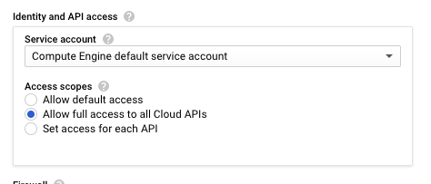

```{r setup, include=FALSE}
knitr::opts_chunk$set(echo = TRUE)
```


(based on __[this](https://alexanderwaldin.github.io/jupyter-notebook-rstudio-cloud.html)__ and __[this](https://stharrold.github.io/20151208-ipynb-on-gce-from-chrome.html#fn:lsof-kill)__ blog posts)

### Setting up a Cloud instance

Setup is pretty straightforward. Follow the __[quickstart](https://cloud.google.com/compute/docs/quickstart-linux)__; here are my settings:

* Instance size: I chose the smallest to start, but you can __[resize](https://cloud.google.com/compute/docs/instances/changing-machine-type-of-stopped-instance)__ at any time.
* Operating System: I chose Debian for it's stability.
* Hard disk: I highly recommend a 10Gbyte SSD drive: 
  * SSD for speed.
  * 10Gbyte to save money. You can always make it larger later, but not smaller.
* Firewall: Allow HTTP and HTTPS connections to use `curl` and `wget`.
* __If you access GCloud with an in-browser terminal and run across an error "Insufficient authentication scopes", set  Access scopes to "Allow full access to all Cloud APIs". (During instance creation, or edit later, whith stopped instance.)__



* Once you have the instance running, connect to it using __[gcloud tools](https://cloud.google.com/compute/docs/instances/connecting-to-instance#sshingcloud)__.

### Setting up a Jupyter Notebook
Follow the jupyter installation instructions. If you decide to install the Anaconda distribution like I did, here are a few notes:

##### On VM terminal: 

Copy the downloader path, and use `curl` to download the latest release.
__[instructions on how to download and install Anaconda from command line](https://www.digitalocean.com/community/tutorials/how-to-install-anaconda-on-ubuntu-18-04-quickstart)__

If Anaconda installation is interrupted with this error:  __"bunzip2: command not found"__, run:

    sudo apt-get install bzip2 

Anaconda adds a line to your .bashrc exporting the correct path to your distribution. Make sure it is correct (it looks like PATH="/home/username/path/to/anaconda3/bin:$PATH")
Source you bashrc source ~/.bashrc and ensure the latest version of conda is installed by entering conda -V.
You can now start your jupyter notebook with: 

    jupyter notebook --ip=0.0.0.0 --port=8888 --no-browser 

##### On your local machine's terminal:

Install (if you haven't done so yet) __[GCloud SDK](https://cloud.google.com/sdk/docs/#install_the_latest_cloud_tools_version_cloudsdk_current_version)__

To access your jupyter notebook via  browser, you'll need to forward port 8888 to your local machine using ssh. ssh flags can be passed via gcloud: 

    path-to/google-cloud-sdk/bin/gcloud compute ssh username@instance_name --ssh-flag="-L localhost:8888:0.0.0.0:8888" 
    
(from now on the `gcloud` command will imply the path to the command: `path-to/google-cloud-sdk/bin/gcloud`)

You should now be able to navigate the browser on your local machine to http://127.0.0.1:8888/ and see the jupyter interface.

### Exchanging Files Between Local Machine, VM, and Google Cloud Bucket

__[Transferring Files to Instances](https://cloud.google.com/compute/docs/instances/transfer-files)__

##### With **SCP**

For example, upload all files from a local directory:

    gcloud compute scp path-to-local-directory/* username@instance_name:path-to-instance-directory

##### With **`gsutil`** 

Create a bucket on __[Cloud Storage](https://cloud.google.com/compute/docs/instances/transfer-files#gcstransfer)__ . Upload local files to the bucket (on local machine's terminal): 

    ./bin/gsutil cp ~/dir/* gs://my_bucket_555
    
Copy files from the bucket to the instance (on VM terminal) (`-r` flag for directories):

    gsutil cp -r gs://my_bucket_555 .

From the instance to the bucket:
    
    gsutil cp -r ~/dir gs://my_bucket_555


